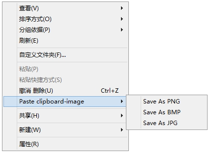
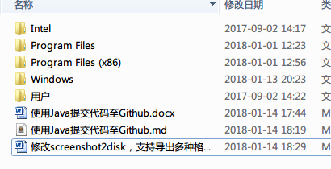

最新版本的screenshot2disk在保存时只能保存一种格式，现在改为在保存时可以选择PNG、JPG、BMP三种格式，如下图所示：

修改其实也很简单，主要是两个地方：

1、修改右键菜单

通过修改注册表，加入一级菜单，如下：

1 Windows Registry Editor Version 5.00

2

3 \[HKEY\_CLASSES\_ROOT\\Directory\\Background\\shell\\Screenshot2Disk\]

4 \"MUIVerb\"=\"Paste clipboard-image\"

5
\"subCommands\"=\"Screenshot2Disk.PNG;Screenshot2Disk.BMP;Screenshot2Disk.JPG\"

6

7 \[HKEY\_CLASSES\_ROOT\\Directory\\shell\\Screenshot2Disk\]

8 \"MUIVerb\"=\"Paste clipboard-image\"

9
\"subCommands\"=\"Screenshot2Disk.PNG;Screenshot2Disk.BMP;Screenshot2Disk.JPG\"

加入二级菜单，如下：

1
\[HKEY\_LOCAL\_MACHINE\\SOFTWARE\\Microsoft\\Windows\\CurrentVersion\\Explorer\\CommandStore\\shell\\Screenshot2Disk.BMP\]

2 @=\"Save As BMP\"

3

4
\[HKEY\_LOCAL\_MACHINE\\SOFTWARE\\Microsoft\\Windows\\CurrentVersion\\Explorer\\CommandStore\\shell\\Screenshot2Disk.BMP\\command\]

5
@=\"D:\\\\test\\\\screenshot2disk22735\\\\Screenshot2Disk\\\\bin\\\\Debug\\\\Screenshot2Disk.exe
%V BMP\"

6

7
\[HKEY\_LOCAL\_MACHINE\\SOFTWARE\\Microsoft\\Windows\\CurrentVersion\\Explorer\\CommandStore\\shell\\Screenshot2Disk.JPG\]

8 @=\"Save As JPG\"

9

10
\[HKEY\_LOCAL\_MACHINE\\SOFTWARE\\Microsoft\\Windows\\CurrentVersion\\Explorer\\CommandStore\\shell\\Screenshot2Disk.JPG\\command\]

11
@=\"D:\\\\test\\\\screenshot2disk22735\\\\Screenshot2Disk\\\\bin\\\\Debug\\\\Screenshot2Disk.exe
%V JPG\"

12

13
\[HKEY\_LOCAL\_MACHINE\\SOFTWARE\\Microsoft\\Windows\\CurrentVersion\\Explorer\\CommandStore\\shell\\Screenshot2Disk.PNG\]

14 @=\"Save As PNG\"

15

16
\[HKEY\_LOCAL\_MACHINE\\SOFTWARE\\Microsoft\\Windows\\CurrentVersion\\Explorer\\CommandStore\\shell\\Screenshot2Disk.PNG\\command\]

17
@=\"D:\\\\test\\\\screenshot2disk22735\\\\Screenshot2Disk\\\\bin\\\\Debug\\\\Screenshot2Disk.exe
%V PNG\"

2、修改保存的方法

支持接收第二个参数，Programe.cs改动如下：

var path = args\[0\];

//第二个表示保存格式的参数

var format = args\[1\];

if (Clipboard.ContainsImage())

{

using(var img = Clipboard.GetImage())

{

ImageFormat imageFormat;

int compression;

//为GetImageSettings增加一个参数，保存的格式来至程序运行输入，不再来至配置

Form1.GetImageSettings(format,out imageFormat, out compression);

ImageHelper.SaveImage(img, path, imageFormat, compression);

}

}

else

Msg.ShowError(\"There is no image or no supported image format in
clipboard\");

修改获取保存格式设置的方法Form1.GetImageSettings(\...\...)，改动如下：

1 public static void GetImageSettings(string format,out ImageFormat
outputformat, out int compression)

2 {

3 //switch (MySettings.Default.OutputFormat)

4 //{

5 // case 0:

6 // outputformat = ImageFormat.Png;

7 // compression = 100;

8 // return;

9 // case 1:

10 // outputformat = ImageFormat.Jpeg;

11 // compression = 75;

12 // return;

13 // case 2:

14 // outputformat = ImageFormat.Jpeg;

15 // compression = 50;

16 // return;

17 // case 3:

18 // outputformat = ImageFormat.Jpeg;

19 // compression = 30;

20 // return;

21 //}

22 switch (format.ToUpper())

23 {

24 case \"PNG\":

25 outputformat = ImageFormat.Png;

26 compression = 100;

27 return;

28 case \"JPG\":

29 outputformat = ImageFormat.Jpeg;

30 compression = 100;

31 return;

32 case \"BMP\":

33 outputformat = ImageFormat.Bmp;

34 compression = 100;

35 return;

36 }

37

38 throw new Exception();

39 }

